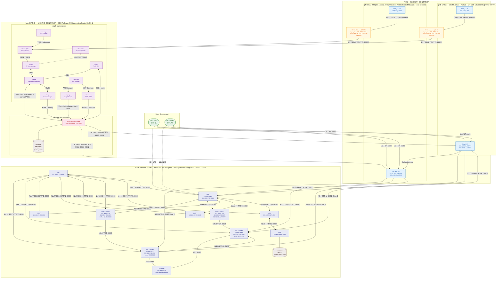

```mermaid
graph TB
    classDef ue      fill:#E8F5E9,stroke:#388E3C,color:#1B5E20,font-size:11px
    classDef gnb     fill:#E3F2FD,stroke:#1976D2,color:#0D47A1,font-size:11px
    classDef e2sim   fill:#FFF8E1,stroke:#F9A825,color:#E65100,font-size:11px
    classDef ric     fill:#F3E5F5,stroke:#7B1FA2,color:#4A148C,font-size:11px
    classDef xapp    fill:#FCE4EC,stroke:#C62828,color:#B71C1C,font-size:11px
    classDef core5g  fill:#E8EAF6,stroke:#303F9F,color:#1A237E,font-size:11px
    classDef db      fill:#EFEBE9,stroke:#6D4C41,color:#3E2723,font-size:11px

    %% ════════════════════════════════════
    %% UEs
    %% ════════════════════════════════════
    subgraph UE_LAYER["User Equipment"]
        UE_S1(["UE — Slice 1\nDNN: oai\n12.1.1.x/24"])
        UE_S2(["UE — Slice 2\nDNN: oai2\n12.1.2.x/24"])
    end

    %% ════════════════════════════════════
    %% RAN
    %% ════════════════════════════════════
    subgraph RAN_LAYER["RAN — LXC RAN-CONTAINER"]
        subgraph GNB21_BOX["gNB OAI 21  |  10.156.12.21  |  PCI:21  |  NR Cell: 101561221  |  TAC: 0x0001"]
            GNB21["OAI gNB 21\nSST=1 SD=0xFFFFFF\nSST=1 SD=0x000002"]
            E2A21["E2 Agent 21\nUDP bridge :7001"]
        end
        subgraph GNB223_BOX["gNB OAI 223  |  10.156.12.223  |  PCI:223  |  NR Cell: 1015612223  |  TAC: 0x0001"]
            GNB223["OAI gNB 223\nSST=1 SD=0xFFFFFF\nSST=1 SD=0x000002"]
            E2A223["E2 Agent 223\nUDP bridge :7001"]
        end
        E2SIM21["E2 Simulator — gNB 21\nkpm_sim / KPM v2.0 / ASN.1\nMEID: gnb_734_733_61623130\n106 PRBs"]
        E2SIM223["E2 Simulator — gNB 223\nkpm_sim / KPM v2.0 / ASN.1\nMEID: gnb_734_733_61323230\n106 PRBs"]
    end

    %% ════════════════════════════════════
    %% Near-RT RIC
    %% ════════════════════════════════════
    subgraph RIC_LAYER["Near-RT RIC — LXC RIC-CONTAINER  |  OSC Release 4  |  Kubernetes  |  ricip: 10.0.0.1"]
        subgraph RICPLT_NS["ricplt namespace"]
            E2TERM["e2term-alpha\nSCTP :36422"]
            E2MGR["e2mgr\nE2 Node Manager"]
            SUBMGR["submgr\nSubscription Manager"]
            RTMGR["rtmgr\nRoute Manager"]
            A1MED["a1mediator\nHTTP :8080"]
            APPMGR["appmgr\nxApp Lifecycle"]
            DBAAS["dbaas\nRedis SDL"]
            O1MED["o1mediator\nNETCONF/YANG"]
            VESPAMGR["vespamgr\nVES Collector"]
            KONG["Kong Proxy\nAPI Gateway"]
        end
        subgraph XAPP_NS["ricxapp namespace"]
            BROKER["MVNO-BROKER xApp\nRMR messaging / TCP :4200"]
            MONGO[("MongoDB\nDB: Paper1\ngnb_state\n_broker_decision")]
        end
    end

    %% ════════════════════════════════════
    %% 5G Core
    %% ════════════════════════════════════
    subgraph CORE_LAYER["Core Network — LXC CORE-NETWORK  |  OAI CN5G  |  Docker bridge 192.168.70.128/26"]
        NRF["NRF\n192.168.70.130 :8080"]
        AMF["AMF\n192.168.70.132\nSBI :8080  |  N2 :38412"]
        NSSF["NSSF\n192.168.70.139 :8080"]
        UDR["UDR\n192.168.70.136 :8080"]
        UDM["UDM\n192.168.70.137 :8080"]
        AUSF["AUSF\n192.168.70.138 :8080"]
        MYSQL[("MySQL\n192.168.70.131 :3306")]
        SMF1["SMF — Slice 1\n192.168.70.133\nSBI :8080  |  N4 :8805\nSST=1 SD=0xFFFFFF"]
        SMF2["SMF — Slice 2\n192.168.70.140\nSBI :8080  |  N4 :8805\nSST=1 SD=0x000002"]
        UPF1["UPF — Slice 1\n192.168.70.134\nN3 :2152  |  N4 :8805\ntunnel 12.1.1.1/24"]
        UPF2["UPF — Slice 2\n192.168.70.141\nN3 :2152  |  N4 :8805\ntunnel 12.1.2.1/24"]
        EXTDN["oai-ext-dn\n192.168.70.135\nExternal Data Network"]
    end

    %% ════════════════════════════════════
    %% CONNECTIONS
    %% ════════════════════════════════════

    %% Uu — NR air interface
    UE_S1 -- "Uu / NR radio" --> GNB21
    UE_S1 -- "Uu / NR radio" --> GNB223
    UE_S2 -- "Uu / NR radio" --> GNB21
    UE_S2 -- "Uu / NR radio" --> GNB223

    %% N1 — NAS (tunnelled through N2 bearer)
    UE_S1 -. "N1 / NAS" .-> AMF
    UE_S2 -. "N1 / NAS" .-> AMF

    %% N2 — NG-C  gNB ↔ AMF
    GNB21  -- "N2 / NGAP / SCTP :38412" --> AMF
    GNB223 -- "N2 / NGAP / SCTP :38412" --> AMF

    %% N3 — NG-U  gNB ↔ UPF
    GNB21  -- "N3 / GTP-U :2152  Slice 1" --> UPF1
    GNB21  -- "N3 / GTP-U :2152  Slice 2" --> UPF2
    GNB223 -- "N3 / GTP-U :2152  Slice 1" --> UPF1
    GNB223 -- "N3 / GTP-U :2152  Slice 2" --> UPF2

    %% Xn — inter-gNB neighbour
    GNB21 <-- "Xn / neighbour" --> GNB223

    %% E2 path: gNB E2 Agent → E2 Simulator → e2term
    E2A21  -- "UDP :7001 / KPM Protobuf" --> E2SIM21
    E2A223 -- "UDP :7001 / KPM Protobuf" --> E2SIM223
    E2SIM21  -- "E2 / E2AP / SCTP :36422" --> E2TERM
    E2SIM223 -- "E2 / E2AP / SCTP :36422" --> E2TERM

    %% RIC internal — E2 management plane
    E2TERM  <-- "E2AP / RMR" --> E2MGR
    E2MGR   <-- "RMR"        --> SUBMGR
    SUBMGR  <-- "RMR"        --> RTMGR

    %% RIC → xApp
    SUBMGR <-- "RMR / E2 indications + control ACK" --> BROKER
    RTMGR  -- "RMR / routing"                        --> BROKER
    APPMGR -- "lifecycle / onboard-start-stop"        --> BROKER
    DBAAS  <-- "SDL / state"                          --> BROKER
    DBAAS  <-- "SDL"                                  --> SUBMGR
    A1MED  -- "A1 / HTTP REST"                        --> BROKER
    KONG   -- "API Gateway"                           --> A1MED
    KONG   -- "API Gateway"                           --> APPMGR

    %% O1 / VES — management
    O1MED    -. "O1 / NETCONF" .-> E2MGR
    VESPAMGR -. "VES / telemetry" .-> E2TERM

    %% xApp ↔ gNB — UE rate-steering control (direct TCP)
    BROKER -- "UE Rate Control / TCP :5502 :5504" --> GNB21
    BROKER -- "UE Rate Control / TCP :5506 :5508 :5512" --> GNB223

    %% xApp ↔ MongoDB
    BROKER --- MONGO

    %% SBI — service-based interfaces (HTTP/2 :8080)
    NRF <-- "Nnrf / SBI / HTTP2 :8080" --> AMF
    NRF <-- "Nnrf / SBI / HTTP2 :8080" --> SMF1
    NRF <-- "Nnrf / SBI / HTTP2 :8080" --> SMF2
    NRF <-- "Nnrf / SBI / HTTP2 :8080" --> UDM
    NRF <-- "Nnrf / SBI / HTTP2 :8080" --> AUSF
    NRF <-- "Nnrf / SBI / HTTP2 :8080" --> NSSF
    NRF <-- "Nnrf / SBI / HTTP2 :8080" --> UPF1
    NRF <-- "Nnrf / SBI / HTTP2 :8080" --> UPF2
    AMF <-- "Nudm  / HTTP2 :8080" --> UDM
    AMF <-- "Nausf / HTTP2 :8080" --> AUSF
    AMF <-- "Nnssf / HTTP2 :8080" --> NSSF
    AMF <-- "Nsmf  / HTTP2 :8080" --> SMF1
    AMF <-- "Nsmf  / HTTP2 :8080" --> SMF2
    UDM <-- "Nudr  / HTTP2 :8080" --> UDR
    UDR --- MYSQL

    %% N4 — SMF ↔ UPF (PFCP session management)
    SMF1 -- "N4 / PFCP :8805" --> UPF1
    SMF2 -- "N4 / PFCP :8805" --> UPF2

    %% N9 — UPF ↔ UPF (inter-slice GTP-U)
    UPF1 <-- "N9 / GTP-U :2152" --> UPF2

    %% N6 — UPF → External Data Network
    UPF1 -- "N6 / SNAT" --> EXTDN
    UPF2 -- "N6 / SNAT" --> EXTDN

    %% ── class assignments ──
    class UE_S1,UE_S2 ue
    class GNB21,GNB223,E2A21,E2A223 gnb
    class E2SIM21,E2SIM223 e2sim
    class E2TERM,E2MGR,SUBMGR,RTMGR,A1MED,APPMGR,DBAAS,O1MED,VESPAMGR,KONG ric
    class BROKER xapp
    class MONGO db
    class NRF,AMF,NSSF,UDR,UDM,AUSF,SMF1,SMF2,UPF1,UPF2,EXTDN core5g
    class MYSQL db
```
